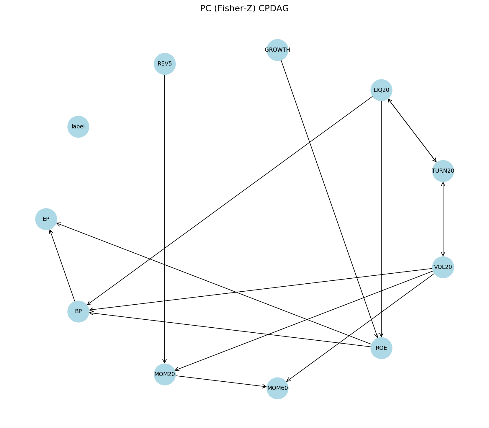
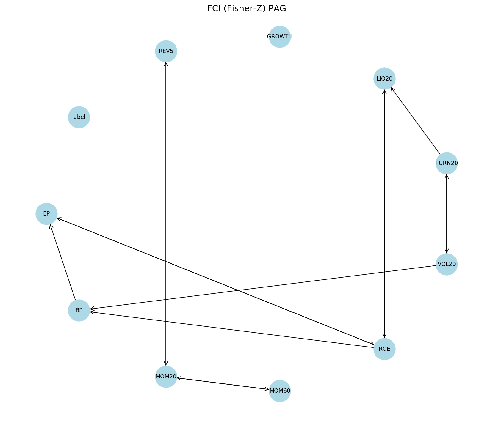
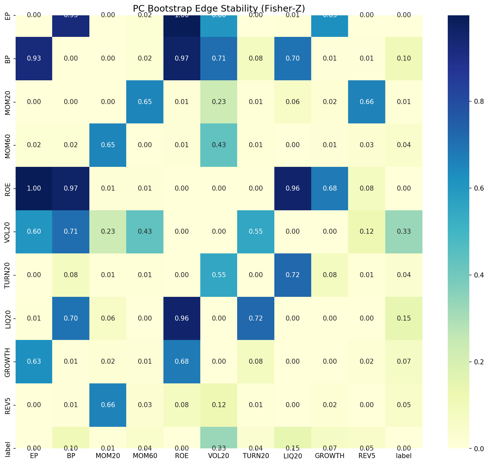
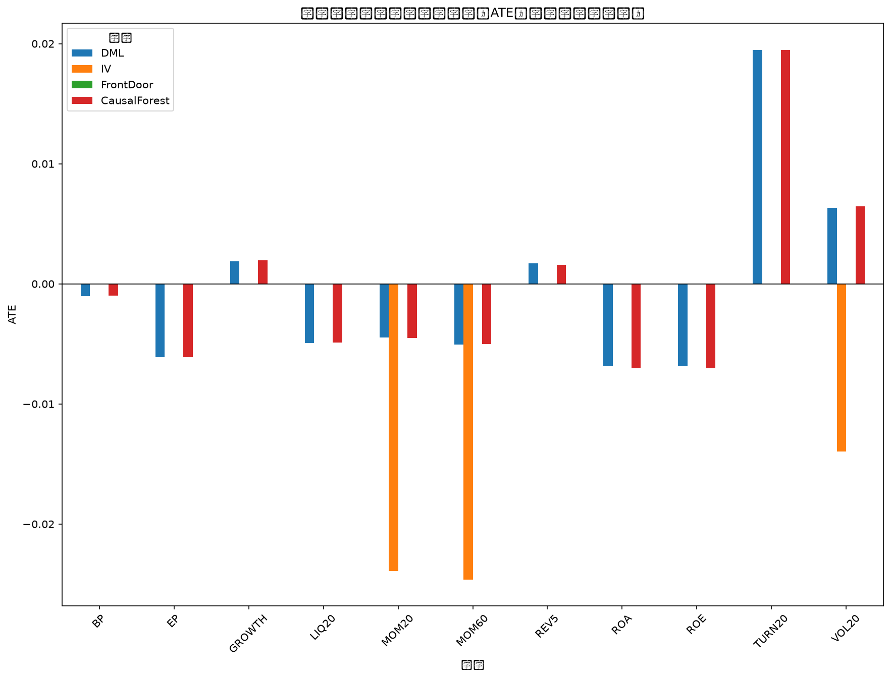
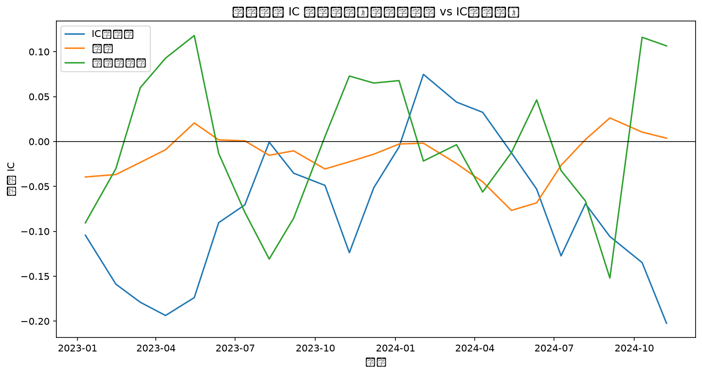
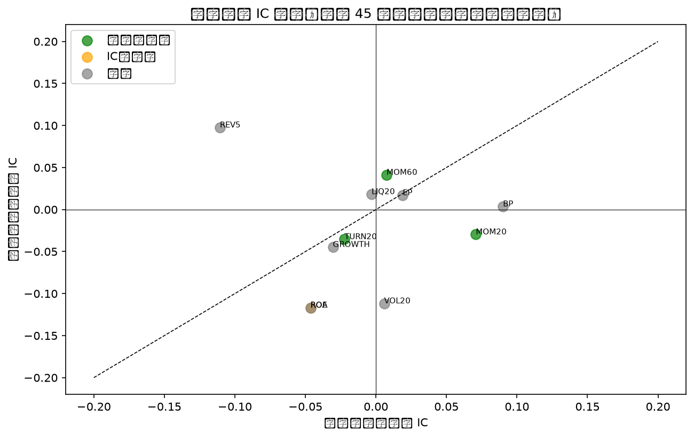
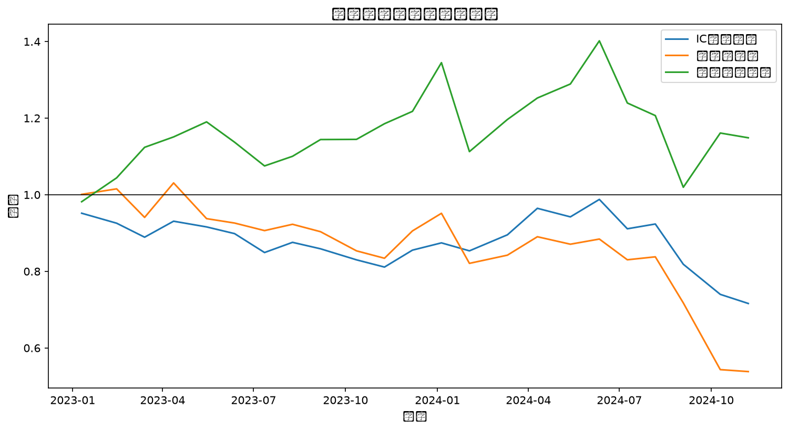
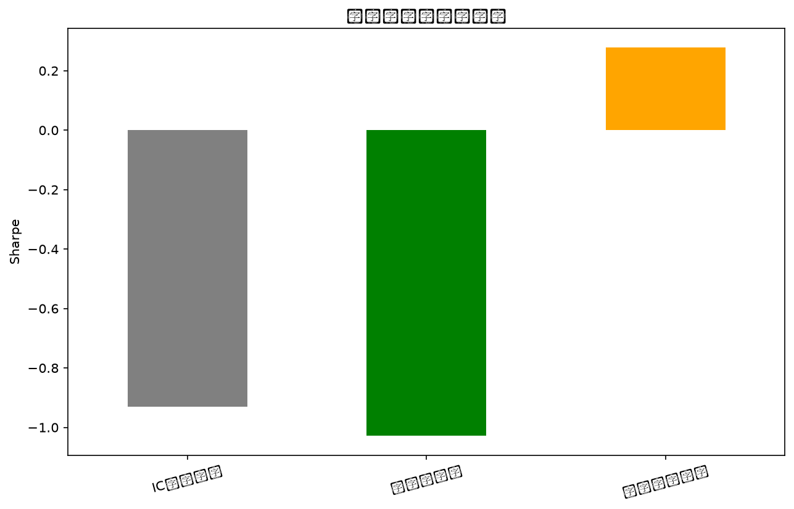
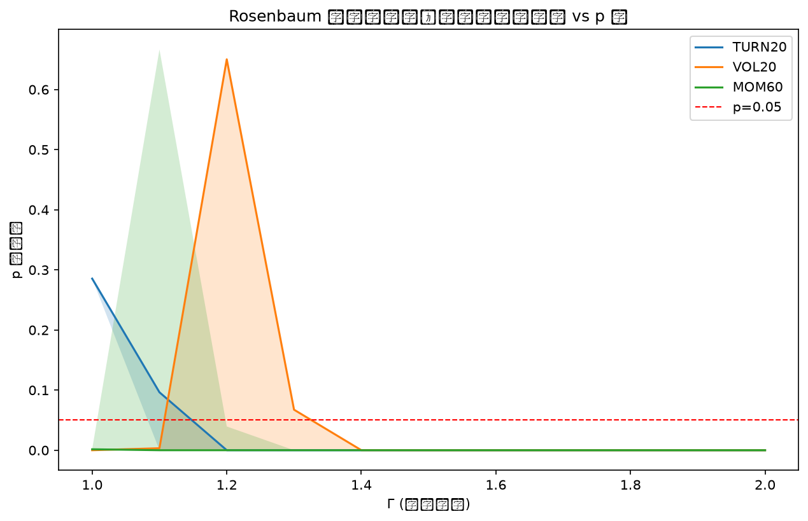
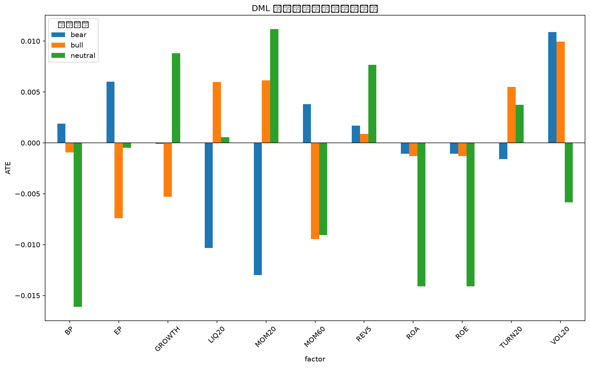

# 因果推断框架下的多因子选股研究

## 摘要

部分传统 IC 显著因子（如 ROE）在因果推断中并不显著，存在伪因子风险。 因果显著因子包括：MOM20, MOM60, TURN20。 因果显著因子组合样本外夏普（0.2777）高于 IC 显著因子组合（-0.9302），支持因果因子更稳健的判断。

## 因子定义

| 因子     | 含义                          |
|:-------|:----------------------------|
| EP     | 盈利收益率 Earnings Yield = 1/PE |
| BP     | 账面市值比 Book-to-Price = 1/PB  |
| MOM20  | 20日动量 (剔除最近1日)              |
| MOM60  | 60日动量 (剔除最近1日)              |
| ROE    | 净资产收益率                      |
| ROA    | 总资产收益率                      |
| VOL20  | 20日收益波动率 (年化)               |
| TURN20 | 20日平均换手率                    |
| LIQ20  | 20日平均成交量 (对数)               |
| GROWTH | 净利润同比增长率                    |
| REV5   | 5日短期反转                      |

## 因果发现

对真实数据进行 **1000 次** Bootstrap 重采样，同时运行 PC 与 FCI 算法。
共识别 **0** 条稳定边（稳定性 > 70%）。

## 因果效应估计：四维方法矩阵

### DML

| factor   | method   |         ate |         se |    tvalue |      pvalue |    ci_lower |   ci_upper |    ols_beta |     ols_se |   ols_pvalue |    n |   resid_D_mean |   resid_D_std | econml_used   |   propensity_overlap | dml_balanced   | dml_overlap_ok   | dml_valid   |   first_stage_f |   first_stage_f_pvalue |   sargan_stat |   sargan_pvalue |   iv_valid |   beta1 |   beta2 |   beta1_pvalue |   beta2_pvalue |   identification_pass |   fd_valid |   ite_mean |   ite_std |   ite_q10 |   ite_q90 |   cf_valid |   ite_q01 |   ite_q99 |
|:---------|:---------|------------:|-----------:|----------:|------------:|------------:|-----------:|------------:|-----------:|-------------:|-----:|---------------:|--------------:|:--------------|---------------------:|:---------------|:-----------------|:------------|----------------:|-----------------------:|--------------:|----------------:|-----------:|--------:|--------:|---------------:|---------------:|----------------------:|-----------:|-----------:|----------:|----------:|----------:|-----------:|----------:|----------:|
| EP       | DML      | -0.00610588 | 0.00706388 | -0.86438  | 0.387552    | -0.0199648  | 0.00775303 | -0.00893832 | 0.00551476 |  0.105326    | 1204 |   -0.00595706  |      0.436298 | False         |             0.906241 | True           | True             | True        |             nan |                    nan |           nan |             nan |        nan |     nan |     nan |            nan |            nan |                   nan |        nan |        nan |       nan |       nan |       nan |        nan |       nan |       nan |
| BP       | DML      | -0.0010042  | 0.00644665 | -0.155771 | 0.87624     | -0.0136521  | 0.0116437  |  0.00591244 | 0.005904   |  0.316823    | 1204 |   -0.00384764  |      0.4782   | False         |             0.952778 | True           | True             | True        |             nan |                    nan |           nan |             nan |        nan |     nan |     nan |            nan |            nan |                   nan |        nan |        nan |       nan |       nan |       nan |        nan |       nan |       nan |
| MOM20    | DML      | -0.00447305 | 0.00368697 | -1.2132   | 0.22529     | -0.0117067  | 0.00276057 | -0.00182053 | 0.00378055 |  0.630214    | 1204 |    0.000247982 |      0.83681  | False         |             0.908235 | True           | True             | True        |             nan |                    nan |           nan |             nan |        nan |     nan |     nan |            nan |            nan |                   nan |        nan |        nan |       nan |       nan |       nan |        nan |       nan |       nan |
| MOM60    | DML      | -0.00503324 | 0.00367126 | -1.37099  | 0.170635    | -0.012236   | 0.00216954 | -0.00619165 | 0.00377173 |  0.100939    | 1204 |   -0.00541693  |      0.83993  | False         |             0.962562 | True           | True             | True        |             nan |                    nan |           nan |             nan |        nan |     nan |     nan |            nan |            nan |                   nan |        nan |        nan |       nan |       nan |       nan |        nan |       nan |       nan |
| ROE      | DML      | -0.00688087 | 0.00596782 | -1.153    | 0.249141    | -0.0185894  | 0.00482763 | -0.00117537 | 0.00492518 |  0.811422    | 1204 |   -0.00263639  |      0.517101 | False         |             0.920459 | True           | True             | True        |             nan |                    nan |           nan |             nan |        nan |     nan |     nan |            nan |            nan |                   nan |        nan |        nan |       nan |       nan |       nan |        nan |       nan |       nan |
| ROA      | DML      | -0.00688087 | 0.00596782 | -1.153    | 0.249141    | -0.0185894  | 0.00482763 | -0.00117537 | 0.00492518 |  0.811422    | 1204 |   -0.00263639  |      0.517101 | False         |             0.920459 | True           | True             | True        |             nan |                    nan |           nan |             nan |        nan |     nan |     nan |            nan |            nan |                   nan |        nan |        nan |       nan |       nan |       nan |        nan |       nan |       nan |
| VOL20    | DML      |  0.00632531 | 0.00453706 |  1.39414  | 0.163532    | -0.00257613 | 0.0152267  |  0.00773829 | 0.00427492 |  0.0705237   | 1204 |   -0.00325098  |      0.678489 | False         |             0.938743 | True           | True             | True        |             nan |                    nan |           nan |             nan |        nan |     nan |     nan |            nan |            nan |                   nan |        nan |        nan |       nan |       nan |       nan |        nan |       nan |       nan |
| TURN20   | DML      |  0.019498   | 0.00453209 |  4.3022   | 1.82835e-05 |  0.0106063  | 0.0283896  |  0.0170252  | 0.00464027 |  0.000254276 | 1204 |    0.00080722  |      0.675845 | False         |             0.932191 | True           | True             | True        |             nan |                    nan |           nan |             nan |        nan |     nan |     nan |            nan |            nan |                   nan |        nan |        nan |       nan |       nan |       nan |        nan |       nan |       nan |
| LIQ20    | DML      | -0.00492442 | 0.00443144 | -1.11124  | 0.266685    | -0.0136186  | 0.00376981 | -0.00395385 | 0.0043787  |  0.366724    | 1204 |    0.00102398  |      0.691989 | False         |             0.924596 | True           | True             | True        |             nan |                    nan |           nan |             nan |        nan |     nan |     nan |            nan |            nan |                   nan |        nan |        nan |       nan |       nan |       nan |        nan |       nan |       nan |
| GROWTH   | DML      |  0.00189506 | 0.00344574 |  0.549971 | 0.582441    | -0.00486528 | 0.00865539 |  0.00276404 | 0.0034861  |  0.428009    | 1204 |   -0.0099039   |      0.896556 | False         |             0.891293 | True           | True             | True        |             nan |                    nan |           nan |             nan |        nan |     nan |     nan |            nan |            nan |                   nan |        nan |        nan |       nan |       nan |       nan |        nan |       nan |       nan |
| REV5     | DML      |  0.00169452 | 0.00331703 |  0.510855 | 0.609546    | -0.00481329 | 0.00820233 |  0.00045455 | 0.00341556 |  0.894151    | 1204 |   -0.0010495   |      0.929466 | False         |             0.917917 | True           | True             | True        |             nan |                    nan |           nan |             nan |        nan |     nan |     nan |            nan |            nan |                   nan |        nan |        nan |       nan |       nan |       nan |        nan |       nan |       nan |

### IV

| factor   | method   |         ate |         se |   tvalue |      pvalue |    ci_lower |    ci_upper |   ols_beta |   ols_se |   ols_pvalue |   n |   resid_D_mean |   resid_D_std |   econml_used |   propensity_overlap |   dml_balanced |   dml_overlap_ok |   dml_valid |   first_stage_f |   first_stage_f_pvalue |   sargan_stat |   sargan_pvalue | iv_valid   |   beta1 |   beta2 |   beta1_pvalue |   beta2_pvalue |   identification_pass |   fd_valid |   ite_mean |   ite_std |   ite_q10 |   ite_q90 |   cf_valid |   ite_q01 |   ite_q99 |
|:---------|:---------|------------:|-----------:|---------:|------------:|------------:|------------:|-----------:|---------:|-------------:|----:|---------------:|--------------:|--------------:|---------------------:|---------------:|-----------------:|------------:|----------------:|-----------------------:|--------------:|----------------:|:-----------|--------:|--------:|---------------:|---------------:|----------------------:|-----------:|-----------:|----------:|----------:|----------:|-----------:|----------:|----------:|
| EP       | IV       | -0.00990085 | 0.00636159 | -1.55635 | 0.119978    | -0.0223862  |  0.00258448 |        nan |      nan |          nan | 914 |            nan |           nan |           nan |                  nan |            nan |              nan |         nan |       2678.65   |           0            |   0.269279    |      0.603816   | False      |     nan |     nan |            nan |            nan |                   nan |        nan |        nan |       nan |       nan |       nan |        nan |       nan |       nan |
| BP       | IV       |  0.00689673 | 0.00655677 |  1.05185 | 0.293152    | -0.00597166 |  0.0197651  |        nan |      nan |          nan | 914 |            nan |           nan |           nan |                  nan |            nan |              nan |         nan |      12733.3    |           0            |   8.71956e-08 |      0.999764   | False      |     nan |     nan |            nan |            nan |                   nan |        nan |        nan |       nan |       nan |       nan |        nan |       nan |       nan |
| MOM20    | IV       | -0.0239336  | 0.00907722 | -2.63667 | 0.0085171   | -0.0417487  | -0.00611859 |        nan |      nan |          nan | 914 |            nan |           nan |           nan |                  nan |            nan |              nan |         nan |        115.458  |           2.43463e-45  |   1.2987      |      0.254451   | True       |     nan |     nan |            nan |            nan |                   nan |        nan |        nan |       nan |       nan |       nan |        nan |       nan |       nan |
| MOM60    | IV       | -0.0246104  | 0.00582484 | -4.22508 | 2.63266e-05 | -0.0360423  | -0.0131785  |        nan |      nan |          nan | 914 |            nan |           nan |           nan |                  nan |            nan |              nan |         nan |        428.892  |           2.15166e-131 |   0.260075    |      0.610069   | True       |     nan |     nan |            nan |            nan |                   nan |        nan |        nan |       nan |       nan |       nan |        nan |       nan |       nan |
| ROE      | IV       | -0.00635726 | 0.00572819 | -1.10982 | 0.267374    | -0.0175995  |  0.00488496 |        nan |      nan |          nan | 914 |            nan |           nan |           nan |                  nan |            nan |              nan |         nan |       2211.46   |           0            |   3.10534     |      0.0780358  | False      |     nan |     nan |            nan |            nan |                   nan |        nan |        nan |       nan |       nan |       nan |        nan |       nan |       nan |
| ROA      | IV       | -0.00635726 | 0.00572819 | -1.10982 | 0.267374    | -0.0175995  |  0.00488496 |        nan |      nan |          nan | 914 |            nan |           nan |           nan |                  nan |            nan |              nan |         nan |       2211.46   |           0            |   3.10534     |      0.0780358  | False      |     nan |     nan |            nan |            nan |                   nan |        nan |        nan |       nan |       nan |       nan |        nan |       nan |       nan |
| VOL20    | IV       | -0.0139388  | 0.0137797  | -1.01155 | 0.312027    | -0.040983   |  0.0131054  |        nan |      nan |          nan | 914 |            nan |           nan |           nan |                  nan |            nan |              nan |         nan |         60.5847 |           2.09799e-25  |   0.645394    |      0.421764   | True       |     nan |     nan |            nan |            nan |                   nan |        nan |        nan |       nan |       nan |       nan |        nan |       nan |       nan |
| TURN20   | IV       |  0.0193613  | 0.00662027 |  2.92455 | 0.00353643  |  0.00636828 |  0.0323543  |        nan |      nan |          nan | 914 |            nan |           nan |           nan |                  nan |            nan |              nan |         nan |        808.772  |           2.02133e-201 |   5.08927     |      0.0240743  | False      |     nan |     nan |            nan |            nan |                   nan |        nan |        nan |       nan |       nan |       nan |        nan |       nan |       nan |
| LIQ20    | IV       | -0.00933803 | 0.00529876 | -1.7623  | 0.0783584   | -0.0197374  |  0.00106138 |        nan |      nan |          nan | 914 |            nan |           nan |           nan |                  nan |            nan |              nan |         nan |       2980.15   |           0            |   0.0538033   |      0.816573   | False      |     nan |     nan |            nan |            nan |                   nan |        nan |        nan |       nan |       nan |       nan |        nan |       nan |       nan |
| GROWTH   | IV       |  0.00639981 | 0.00473432 |  1.35179 | 0.176783    | -0.00289183 |  0.0156914  |        nan |      nan |          nan | 914 |            nan |           nan |           nan |                  nan |            nan |              nan |         nan |       1029.49   |           6.69956e-233 |   2.02263     |      0.154971   | False      |     nan |     nan |            nan |            nan |                   nan |        nan |        nan |       nan |       nan |       nan |        nan |       nan |       nan |
| REV5     | IV       |  0.019815   | 0.0108833  |  1.82068 | 0.0689886   | -0.00154469 |  0.0411747  |        nan |      nan |          nan | 914 |            nan |           nan |           nan |                  nan |            nan |              nan |         nan |         61.1991 |           1.22154e-25  |   9.86089     |      0.00168829 | False      |     nan |     nan |            nan |            nan |                   nan |        nan |        nan |       nan |       nan |       nan |        nan |       nan |       nan |

### 前门调整

| factor   | method    |          ate |         se |    tvalue |    pvalue |    ci_lower |     ci_upper |   ols_beta |   ols_se |   ols_pvalue |    n |   resid_D_mean |   resid_D_std |   econml_used |   propensity_overlap |   dml_balanced |   dml_overlap_ok |   dml_valid |   first_stage_f |   first_stage_f_pvalue |   sargan_stat |   sargan_pvalue |   iv_valid |        beta1 |    beta2 |   beta1_pvalue |   beta2_pvalue | identification_pass   | fd_valid   |   ite_mean |   ite_std |   ite_q10 |   ite_q90 |   cf_valid |   ite_q01 |   ite_q99 |
|:---------|:----------|-------------:|-----------:|----------:|----------:|------------:|-------------:|-----------:|---------:|-------------:|-----:|---------------:|--------------:|--------------:|---------------------:|---------------:|-----------------:|------------:|----------------:|-----------------------:|--------------:|----------------:|-----------:|-------------:|---------:|---------------:|---------------:|:----------------------|:-----------|-----------:|----------:|----------:|----------:|-----------:|----------:|----------:|
| EP       | FrontDoor | -0.001501    | 0.00219062 | -0.685196 | 0.493353  | -0.00579461 |  0.00279261  |        nan |      nan |          nan | 1204 |            nan |           nan |           nan |                  nan |            nan |              nan |         nan |             nan |                    nan |           nan |             nan |        nan | -0.00165661  | 0.906069 |      0.492896  |    4.37287e-46 | False                 | False      |        nan |       nan |       nan |       nan |        nan |       nan |       nan |
| BP       | FrontDoor | -0.00145412  | 0.00234478 | -0.62015  | 0.535277  | -0.00604989 |  0.00314166  |        nan |      nan |          nan | 1204 |            nan |           nan |           nan |                  nan |            nan |              nan |         nan |             nan |                    nan |           nan |             nan |        nan | -0.00160486  | 0.906069 |      0.534924  |    4.37287e-46 | False                 | False      |        nan |       nan |       nan |       nan |        nan |       nan |       nan |
| MOM20    | FrontDoor |  0.00113945  | 0.0015021  |  0.758571 | 0.448258  | -0.00180467 |  0.00408357  |        nan |      nan |          nan | 1204 |            nan |           nan |           nan |                  nan |            nan |              nan |         nan |             nan |                    nan |           nan |             nan |        nan |  0.00125758  | 0.906069 |      0.44767   |    4.37287e-46 | False                 | False      |        nan |       nan |       nan |       nan |        nan |       nan |       nan |
| MOM60    | FrontDoor | -0.0030085   | 0.00151023 | -1.99208  | 0.0465882 | -0.00596855 | -4.8448e-05  |        nan |      nan |          nan | 1204 |            nan |           nan |           nan |                  nan |            nan |              nan |         nan |             nan |                    nan |           nan |             nan |        nan | -0.00332039  | 0.906069 |      0.0446405 |    4.37287e-46 | False                 | False      |        nan |       nan |       nan |       nan |        nan |       nan |       nan |
| ROE      | FrontDoor |  0.00184437  | 0.00195827 |  0.941835 | 0.346466  | -0.00199384 |  0.00568258  |        nan |      nan |          nan | 1204 |            nan |           nan |           nan |                  nan |            nan |              nan |         nan |             nan |                    nan |           nan |             nan |        nan |  0.00203557  | 0.906069 |      0.345502  |    4.37287e-46 | False                 | False      |        nan |       nan |       nan |       nan |        nan |       nan |       nan |
| ROA      | FrontDoor |  0.00184437  | 0.00195827 |  0.941835 | 0.346466  | -0.00199384 |  0.00568258  |        nan |      nan |          nan | 1204 |            nan |           nan |           nan |                  nan |            nan |              nan |         nan |             nan |                    nan |           nan |             nan |        nan |  0.00203557  | 0.906069 |      0.345502  |    4.37287e-46 | False                 | False      |        nan |       nan |       nan |       nan |        nan |       nan |       nan |
| VOL20    | FrontDoor | -0.00361625  | 0.00171362 | -2.1103   | 0.035039  | -0.00697494 | -0.000257551 |        nan |      nan |          nan | 1204 |            nan |           nan |           nan |                  nan |            nan |              nan |         nan |             nan |                    nan |           nan |             nan |        nan | -0.00399114  | 0.906069 |      0.0332264 |    4.37287e-46 | False                 | False      |        nan |       nan |       nan |       nan |        nan |       nan |       nan |
| TURN20   | FrontDoor | -0.000299802 | 0.0018414  | -0.162812 | 0.870694  | -0.00390895 |  0.00330934  |        nan |      nan |          nan | 1204 |            nan |           nan |           nan |                  nan |            nan |              nan |         nan |             nan |                    nan |           nan |             nan |        nan | -0.000330882 | 0.906069 |      0.870686  |    4.37287e-46 | False                 | False      |        nan |       nan |       nan |       nan |        nan |       nan |       nan |
| LIQ20    | FrontDoor | -0.000508531 | 0.00173784 | -0.292623 | 0.769861  | -0.00391469 |  0.00289763  |        nan |      nan |          nan | 1204 |            nan |           nan |           nan |                  nan |            nan |              nan |         nan |             nan |                    nan |           nan |             nan |        nan | -0.00056125  | 0.906069 |      0.769818  |    4.37287e-46 | False                 | False      |        nan |       nan |       nan |       nan |        nan |       nan |       nan |
| GROWTH   | FrontDoor |  0.000732737 | 0.00138418 |  0.529364 | 0.59665   | -0.00198026 |  0.00344574  |        nan |      nan |          nan | 1204 |            nan |           nan |           nan |                  nan |            nan |              nan |         nan |             nan |                    nan |           nan |             nan |        nan |  0.0008087   | 0.906069 |      0.596419  |    4.37287e-46 | False                 | False      |        nan |       nan |       nan |       nan |        nan |       nan |       nan |
| REV5     | FrontDoor | -0.00128752  | 0.00135807 | -0.948051 | 0.343294  | -0.00394934 |  0.0013743   |        nan |      nan |          nan | 1204 |            nan |           nan |           nan |                  nan |            nan |              nan |         nan |             nan |                    nan |           nan |             nan |        nan | -0.001421    | 0.906069 |      0.342316  |    4.37287e-46 | False                 | False      |        nan |       nan |       nan |       nan |        nan |       nan |       nan |

### Causal Forest

| factor   | method       |         ate |         se |    tvalue |      pvalue |    ci_lower |   ci_upper |   ols_beta |   ols_se |   ols_pvalue |    n |   resid_D_mean |   resid_D_std | econml_used   |   propensity_overlap |   dml_balanced |   dml_overlap_ok |   dml_valid |   first_stage_f |   first_stage_f_pvalue |   sargan_stat |   sargan_pvalue |   iv_valid |   beta1 |   beta2 |   beta1_pvalue |   beta2_pvalue |   identification_pass |   fd_valid |    ite_mean |   ite_std |   ite_q10 |   ite_q90 | cf_valid   |   ite_q01 |   ite_q99 |
|:---------|:-------------|------------:|-----------:|----------:|------------:|------------:|-----------:|-----------:|---------:|-------------:|-----:|---------------:|--------------:|:--------------|---------------------:|---------------:|-----------------:|------------:|----------------:|-----------------------:|--------------:|----------------:|-----------:|--------:|--------:|---------------:|---------------:|----------------------:|-----------:|------------:|----------:|----------:|----------:|:-----------|----------:|----------:|
| EP       | CausalForest | -0.00608892 | 0.00704556 | -0.864221 | 0.387639    | -0.0198982  | 0.00772038 |        nan |      nan |          nan | 1204 |            nan |           nan | False         |                  nan |            nan |              nan |         nan |             nan |                    nan |           nan |             nan |        nan |     nan |     nan |            nan |            nan |                   nan |        nan |  0.00601773 |  0.43967  | -0.235636 |  0.196606 | True       |  -1.61262 |   2.56138 |
| BP       | CausalForest | -0.00099228 | 0.0064377  | -0.154136 | 0.877529    | -0.0136102  | 0.0116256  |        nan |      nan |          nan | 1204 |            nan |           nan | False         |                  nan |            nan |              nan |         nan |             nan |                    nan |           nan |             nan |        nan |     nan |     nan |            nan |            nan |                   nan |        nan | -0.0369482  |  0.635292 | -0.316349 |  0.262548 | True       |  -3.45924 |   2.51998 |
| MOM20    | CausalForest | -0.00451365 | 0.0036807  | -1.2263   | 0.220324    | -0.0117278  | 0.00270051 |        nan |      nan |          nan | 1204 |            nan |           nan | False         |                  nan |            nan |              nan |         nan |             nan |                    nan |           nan |             nan |        nan |     nan |     nan |            nan |            nan |                   nan |        nan | -0.0818008  |  0.826451 | -0.377145 |  0.278754 | True       |  -5.59823 |   2.67204 |
| MOM60    | CausalForest | -0.00499101 | 0.0036672  | -1.36099  | 0.173772    | -0.0121787  | 0.00219669 |        nan |      nan |          nan | 1204 |            nan |           nan | False         |                  nan |            nan |              nan |         nan |             nan |                    nan |           nan |             nan |        nan |     nan |     nan |            nan |            nan |                   nan |        nan | -0.00923607 |  0.584395 | -0.254861 |  0.276305 | True       |  -3.00056 |   2.47935 |
| ROE      | CausalForest | -0.00704603 | 0.00594384 | -1.18543  | 0.23608     | -0.018696   | 0.0046039  |        nan |      nan |          nan | 1204 |            nan |           nan | False         |                  nan |            nan |              nan |         nan |             nan |                    nan |           nan |             nan |        nan |     nan |     nan |            nan |            nan |                   nan |        nan |  0.0231464  |  0.513484 | -0.179689 |  0.185335 | True       |  -2.05795 |   3.04417 |
| ROA      | CausalForest | -0.00704603 | 0.00594384 | -1.18543  | 0.23608     | -0.018696   | 0.0046039  |        nan |      nan |          nan | 1204 |            nan |           nan | False         |                  nan |            nan |              nan |         nan |             nan |                    nan |           nan |             nan |        nan |     nan |     nan |            nan |            nan |                   nan |        nan |  0.0176327  |  0.496463 | -0.180752 |  0.197952 | True       |  -2.09334 |   2.69821 |
| VOL20    | CausalForest |  0.00647636 | 0.00453127 |  1.42926  | 0.15319     | -0.00240494 | 0.0153577  |        nan |      nan |          nan | 1204 |            nan |           nan | False         |                  nan |            nan |              nan |         nan |             nan |                    nan |           nan |             nan |        nan |     nan |     nan |            nan |            nan |                   nan |        nan |  0.0177761  |  0.441781 | -0.241966 |  0.237547 | True       |  -1.85815 |   2.3009  |
| TURN20   | CausalForest |  0.0194824  | 0.00452889 |  4.30181  | 1.83153e-05 |  0.0106058  | 0.028359   |        nan |      nan |          nan | 1204 |            nan |           nan | False         |                  nan |            nan |              nan |         nan |             nan |                    nan |           nan |             nan |        nan |     nan |     nan |            nan |            nan |                   nan |        nan |  0.00988665 |  0.477552 | -0.198491 |  0.229519 | True       |  -2.80848 |   2.10759 |
| LIQ20    | CausalForest | -0.00490121 | 0.00442548 | -1.1075   | 0.2683      | -0.0135751  | 0.00377273 |        nan |      nan |          nan | 1204 |            nan |           nan | False         |                  nan |            nan |              nan |         nan |             nan |                    nan |           nan |             nan |        nan |     nan |     nan |            nan |            nan |                   nan |        nan |  0.0349801  |  0.639419 | -0.272138 |  0.299568 | True       |  -2.61495 |   3.59525 |
| GROWTH   | CausalForest |  0.00194706 | 0.00343888 |  0.566191 | 0.57137     | -0.00479314 | 0.00868726 |        nan |      nan |          nan | 1204 |            nan |           nan | False         |                  nan |            nan |              nan |         nan |             nan |                    nan |           nan |             nan |        nan |     nan |     nan |            nan |            nan |                   nan |        nan |  0.0396997  |  0.553679 | -0.20024  |  0.288506 | True       |  -2.4856  |   2.97659 |
| REV5     | CausalForest |  0.00159665 | 0.00331334 |  0.481887 | 0.629974    | -0.00489748 | 0.00809079 |        nan |      nan |          nan | 1204 |            nan |           nan | False         |                  nan |            nan |              nan |         nan |             nan |                    nan |           nan |             nan |        nan |     nan |     nan |            nan |            nan |                   nan |        nan |  0.0272626  |  0.760116 | -0.323104 |  0.374831 | True       |  -3.62634 |   4.21758 |

## 因果因子 vs 相关因子

### 2×2 分类矩阵

|       |   IC显著 |   IC不显著 |
|:------|-------:|--------:|
| 因果显著  |      0 |       3 |
| 因果不显著 |      1 |       7 |

- 因果显著因子：['MOM20', 'MOM60', 'TURN20']
- IC 显著因子：['ROE']
- 伪因子（IC 显著但因果不显著）：['ROE']
- 被掩盖的因子（因果显著但 IC 不显著）：['MOM20', 'MOM60', 'TURN20']

## 组合回测指标

|        |   annual_return |   annual_vol |    sharpe |   max_drawdown |   win_rate |   total_return |    calmar |   information_ratio |   sortino |
|:-------|----------------:|-------------:|----------:|---------------:|-----------:|---------------:|----------:|--------------------:|----------:|
| IC显著因子 |      -0.159881  |     0.171878 | -0.9302   |      -0.275049 |   0.347826 |      -0.283879 | -0.581283 |          -0.640707  | -1.53294  |
| 全因子等权  |      -0.276118  |     0.268433 | -1.02863  |      -0.477806 |   0.434783 |      -0.461694 | -0.577888 |          -0.759398  | -1.15826  |
| 因果显著因子 |       0.0750133 |     0.270129 |  0.277694 |      -0.27273  |   0.652174 |       0.148709 |  0.275046 |           0.0180917 |  0.338341 |

## 稳健性检验

## 识别假设与数学严谨性

- 平均倾向得分重叠度：0.8852
- 共同支撑评估：良好
- SUTVA 高关注因子：['EP', 'BP', 'MOM20', 'MOM60', 'ROE', 'VOL20', 'TURN20', 'LIQ20', 'REV5']

---

所有图表保存在 `figures/` 目录。正式 PDF 可通过 `xelatex report_cn.tex` 编译生成。
